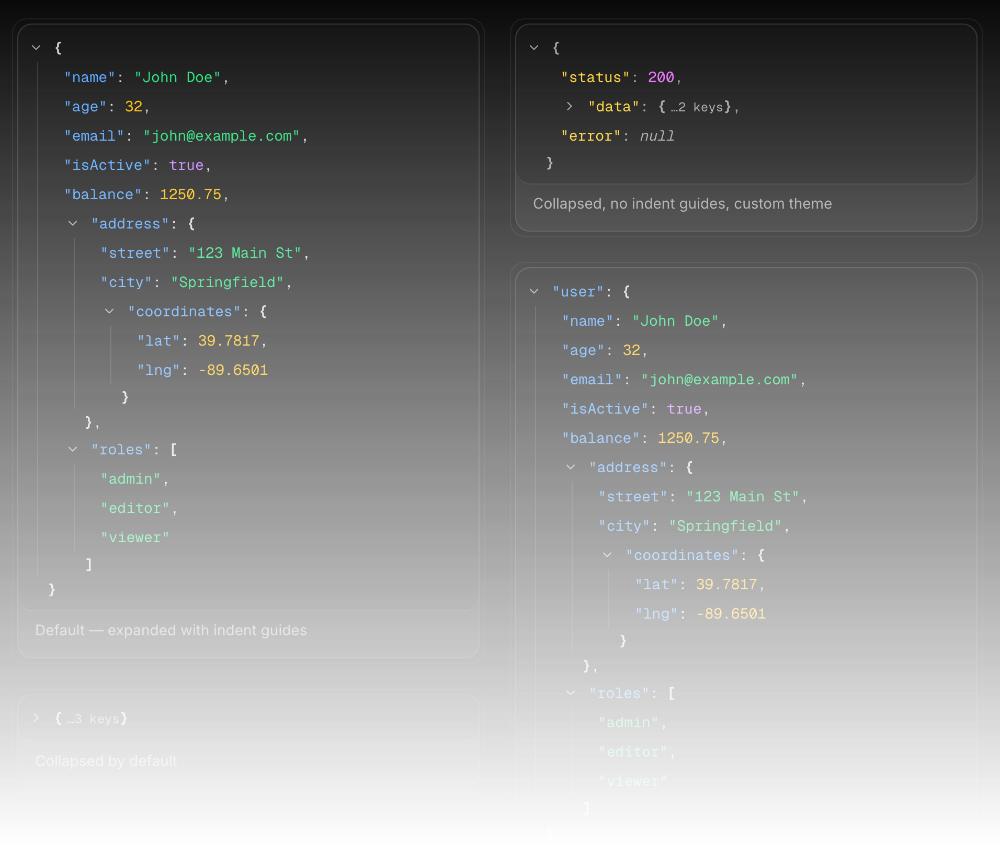

# json-view-cn



A fully-customizable, collapsible, syntax-highlighted JSON tree viewer component for React. Built with [shadcn/ui](https://ui.shadcn.com), [Base UI](https://base-ui.com), and [Tailwind CSS v4](https://tailwindcss.com). Ready to be copy-pasted into your project.

[Live demo](https://json-view-cn.vercel.app/)

## Installation

```bash
npx shadcn@latest add https://json-view-cn.vercel.app/r/json-view.json
```

Or, if the `@json-view-cn` namespace is configured (see [Registry](#registry)):

```bash
npx shadcn@latest add @json-view-cn/json-view
```

The component is added to your `ui` alias (e.g. `components/ui/json-view.tsx`).

> **Note:** The component targets shadcn/ui projects that use **Base UI** primitives (e.g. the `base-mira` style). It relies on the Base UI `render` prop of `TooltipTrigger`, so projects using the Radix-based shadcn/ui components will need to adapt the tooltip usage (e.g. to `asChild`).

### Dependencies

The component relies on these shadcn/ui components:

- `button`
- `tooltip`

And the following packages:

- `lucide-react`
- `clsx` / `tailwind-merge` (via the `cn` utility)

## Usage

```tsx
import { JsonView } from "@/components/ui/json-view"

const data = {
  name: "John Doe",
  age: 32,
  isActive: true,
  address: {
    city: "Springfield",
    coordinates: { lat: 39.78, lng: -89.65 },
  },
  roles: ["admin", "editor"],
}

export default function Page() {
  return <JsonView data={data} />
}
```

## Props

| Prop | Type | Default | Description |
| --- | --- | --- | --- |
| `data` | `unknown` | — | The value to display. Required. Plain JSON works best, but [non-JSON values](#supported-values) are handled too. |
| `className` | `string` | — | Additional classes for the outer wrapper. |
| `defaultExpanded` | `boolean` | `true` | Whether all nodes start expanded or collapsed. |
| `initialDepth` | `number` | — | Expand nodes whose depth is lower than this value (the root is depth `0`, so `1` expands only the root). Overrides `defaultExpanded` when set. |
| `indentGuide` | `boolean` | `true` | Show vertical indent guide lines along nested levels. |
| `rootName` | `string` | — | Optional label displayed as the root node key. |
| `stringTruncate` | `number` | `0` | Truncate strings longer than this value. Hover to preview, click to expand. `0` disables truncation. |
| `theme` | `JsonViewTheme` | — | Override syntax highlight colors. All fields optional. |

Both `JsonViewProps` and `JsonViewTheme` are exported as types.

## Theming

Pass a `theme` prop to customize the colors of each JSON element. All fields are optional and fall back to sensible defaults that work in both light and dark mode.

```tsx
interface JsonViewTheme {
  key?: string       // Key names — default: "text-blue-700 dark:text-blue-400"
  string?: string    // String values — default: "text-green-700 dark:text-green-400"
  number?: string    // Numbers and bigints — default: "text-orange-700 dark:text-amber-400"
  boolean?: string   // Booleans — default: "text-purple-700 dark:text-purple-400"
  null?: string      // null, undefined, functions, symbols, [Circular] — default: "text-gray-500 dark:text-gray-400 italic"
  bracket?: string   // Brackets, colons, commas — default: "text-gray-700 dark:text-gray-300"
  lineHover?: string // Row hover highlight — default: "hover:bg-muted/50"
}
```

### Example: custom theme

```tsx
<JsonView
  data={data}
  theme={{
    key: "text-rose-500 dark:text-rose-400",
    string: "text-yellow-600 dark:text-yellow-300",
    number: "text-violet-600 dark:text-violet-400",
    boolean: "text-cyan-600 dark:text-cyan-400",
    null: "text-pink-500 dark:text-pink-400 italic",
    bracket: "text-gray-500 dark:text-gray-400",
    lineHover: "hover:bg-rose-50 dark:hover:bg-rose-950/20",
  }}
/>
```

## Supported values

`data` is typed as `unknown`, so you can pass values that are not strictly JSON. They are rendered as close as possible to what `JSON.stringify` would produce, without ever throwing:

| Value | Rendered as |
| --- | --- |
| Objects with `toJSON()` (e.g. `Date`) | The result of `toJSON()` — a `Date` shows its ISO string |
| `Map` | An object (keys converted to strings) |
| `Set` | An array |
| `bigint` | The number, unquoted |
| `undefined` | `undefined` |
| Functions | `[Function: name]` |
| Symbols | `Symbol(description)` |
| Circular references | `[Circular]` |

Strings and keys are escaped like JSON, so embedded quotes, backslashes, and control characters (e.g. `\n`) are displayed faithfully. Long values without spaces (URLs, tokens) wrap instead of overflowing the container.

## Examples

### Collapsed by default

```tsx
<JsonView data={data} defaultExpanded={false} />
```

### Expand to depth 1 only

```tsx
<JsonView data={data} initialDepth={1} />
```

### With root name

```tsx
<JsonView data={data} rootName="response" />
```

### String truncation

```tsx
<JsonView data={data} stringTruncate={80} />
```

### No indent guides

```tsx
<JsonView data={data} indentGuide={false} />
```

### Non-JSON values

```tsx
const circular: Record<string, unknown> = { name: "loop" }
circular.self = circular

<JsonView
  data={{
    createdAt: new Date(),
    tags: new Set(["a", "b"]),
    counts: new Map([["x", 1]]),
    id: BigInt("9007199254740993"),
    onClick: function handleClick() {},
    circular,
  }}
/>
```

### Combined

```tsx
<JsonView
  data={data}
  rootName="event"
  initialDepth={2}
  stringTruncate={60}
  indentGuide
/>
```

## Features

- **Collapsible nodes** — Click any object or array row to expand/collapse. Collapsed nodes show their item/key count; empty objects and arrays render inline.
- **Syntax highlighting** — Color-coded keys, strings, numbers, booleans, and null values. Fully customizable via the `theme` prop.
- **Copy on hover** — A copy button appears next to each line on hover or keyboard focus. Objects and arrays are copied as formatted JSON, strings as their raw text.
- **Indent guide lines** — Vertical lines connecting nested levels, with hover highlight. Togglable.
- **String truncation** — Long strings are truncated with a tooltip preview. Click to expand inline, click again to collapse.
- **Depth-based expansion** — Control how deep the tree auto-expands with `initialDepth`.
- **Non-JSON values** — Dates, Maps, Sets, bigints, functions, `undefined`, and circular references are handled safely.
- **Faithful escaping and wrapping** — Strings and keys are escaped like JSON; long unbroken values wrap.
- **Keyboard accessible** — Expand/collapse toggles, copy buttons, and truncated-string toggles are real buttons with focus rings and `aria-expanded` / `aria-label` attributes.
- **Dark mode** — Works out of the box with light and dark themes.
- **Self-contained** — No external JSON viewer libraries. Just shadcn/ui primitives and Tailwind.
- **Copy-paste ready** — No global CSS required. Drop the component file into your project and use it.

## Tech stack

The demo site and registry are built with:

- [Next.js 16](https://nextjs.org) with App Router
- [React 19](https://react.dev)
- [Tailwind CSS v4](https://tailwindcss.com)
- [shadcn/ui v4](https://ui.shadcn.com) with [Base UI](https://base-ui.com) primitives
- [TypeScript](https://www.typescriptlang.org)

## Registry

This repo is a [shadcn registry](https://ui.shadcn.com/docs/registry). It is flat
and served from `https://json-view-cn.vercel.app/r/`:

| URL | Contents |
| --- | --- |
| [`/r/registry.json`](https://json-view-cn.vercel.app/r/registry.json) | The registry index (no `content` fields) |
| [`/r/json-view.json`](https://json-view-cn.vercel.app/r/json-view.json) | The `json-view` registry item |

Both files are generated from the root `registry.json` by `pnpm registry:build` and
committed under `public/r`.

### Using the namespace

Add the registry to your project's `components.json`:

```json
{
  "registries": {
    "@json-view-cn": "https://json-view-cn.vercel.app/r/{name}.json"
  }
}
```

Then install items by name:

```bash
npx shadcn@latest add @json-view-cn/json-view
```

## Development

```bash
pnpm install
pnpm dev             # start the demo site
pnpm lint            # run ESLint
pnpm typecheck       # run the TypeScript compiler
pnpm registry:build  # rebuild public/r from registry.json
```

The component source lives in `registry/json-view/json-view.tsx`. The demo page (`app/page.tsx`) and showcase (`components/showcase.tsx`) import it directly, and `pnpm registry:build` generates the installable files in `public/r`.

See [CONTRIBUTING.md](CONTRIBUTING.md) for more details.

## License

[MIT](LICENSE)
